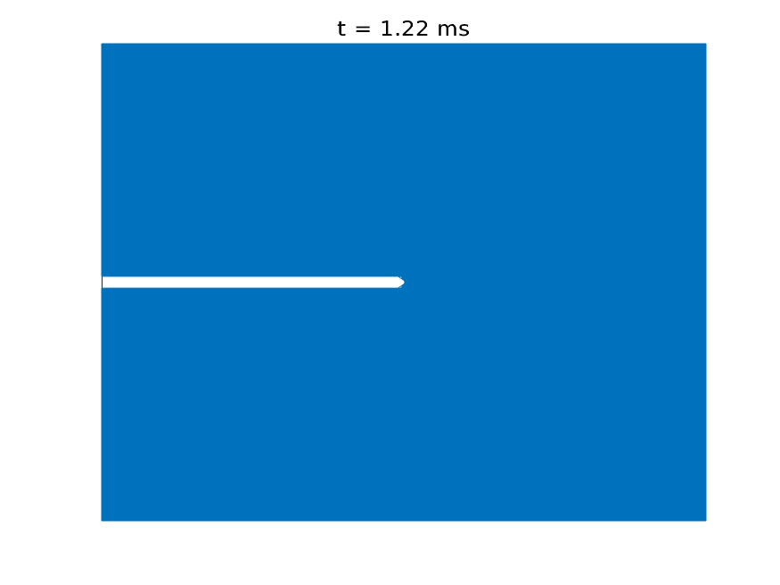

# Crack propagation through media using nonlocal PDE

See Reference.

# Requirements

MATLAB with image processing toolbox

OR,

OCTAVE 

# Example

Crack propagation and branching in soda-lime glass with a pre-notch under vertical outward force

# Usage

* To create the reference neighbourhood array.
`ref = nbd();` Took 48s on my CPU.

* Draw the initial mesh for the slab with a pre-notch
`drawmesh(ref);  `

* Create the final neighbourhood array for the cracked slab, from the initial array
`final = proj(ref);   `  This is where all the computations happen.

* Draw the final array
`drawmesh(final);  `
* You can plot the neighbourhood weight matrix using
`nbdmap(final);`
* You can plot the relative neighbourhood weight matrix by
`damamge(final);`
* You can zoom in and out on the picture generated by `drawmesh();`.

# Reference

Studies of dynamic crack propagation and crack branching with peridynamics 
Youn Doh Ha, Florin Bobaru
Link: http://digitalcommons.unl.edu/cgi/viewcontent.cgi?article=1070&context=engineeringmechanicsfacpub

Special thanks to Dr. Jeremy Trageser for teaching the course.

# Todo

Faster mesh generation and other shapes of pre-notch
